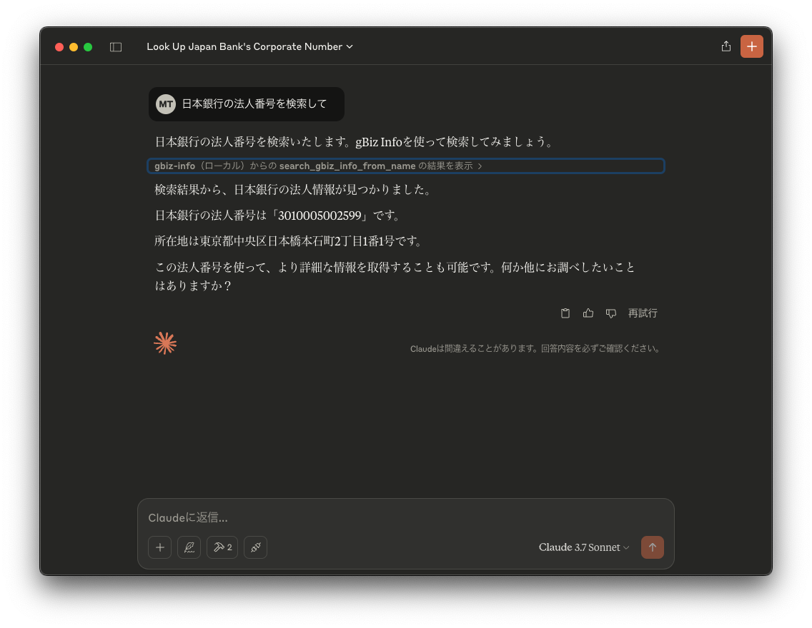
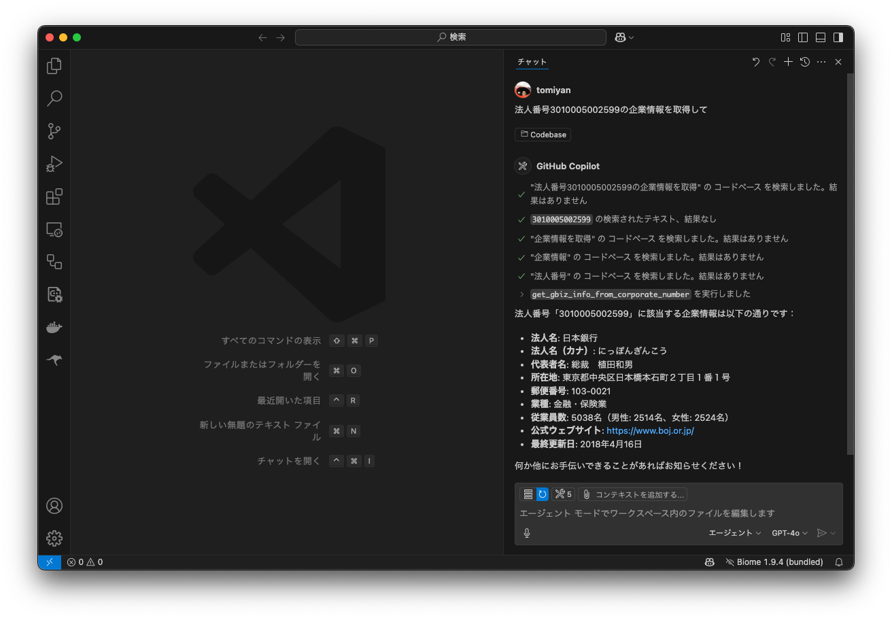

# mcp-gbiz-info

gBizINFO 法人番号 MCP Server
経済産業省の[gBizINFO API](https://info.gbiz.go.jp/api/index.html)を利用して法人番号を取得するためのMCP Serverです

[利用申請](https://info.gbiz.go.jp/hojin/api_registration/form)をしてアクセストークンを発行して利用してください

## 注意事項

- gBizINFOは2026年1月に新システムに移行予定のため、APIの仕様などが変わるかもしれません
- また、データの更新も段階的に停止されるようです

## 機能

- `search_gbiz_info_from_name`
  - 法人名から法人番号を検索します
- `search_gbiz_info_from_number`
  - 法人番号から法人情報を取得します

## Claude Desktopでの利用方法

1. `claude_desktop_config.json` に以下のように記述してください

macOSだと `~/Library/Application Support/Claude/` にあります

```json
{
    "mcpServers": {
        "gbiz-info": {
            "command": "npx",
            "args": [
                "-y",
                "mcp-gbiz-info@latest"
            ],
            "env": {
                "GBIZ_INFO_API_KEY": "<YOUR_API_TOKEN>"
            }
        }
      }
}
```

2. Claude Desktopを再起動してから、「日本銀行の法人番号を検索して」とプロンプトを入力してみてください



## VSCodeでの利用方法

`settings.json` に以下のように記述してください

```json
{
  "mcp": {
        "inputs": [],
        "servers": {
            "gbiz-info": {
                "command": "npx",
                "args": [
                    "-y",
                    "mcp-gbiz-info@latest"
                ],
                "env": {
                    "GBIZ_INFO_API_KEY": "<YOUR_API_TOKEN>"
                }
            }
        }
  }
}
```
2. Claude Desktopを再起動してから、「日本銀行の法人番号を検索して」とプロンプトを入力してみてください


